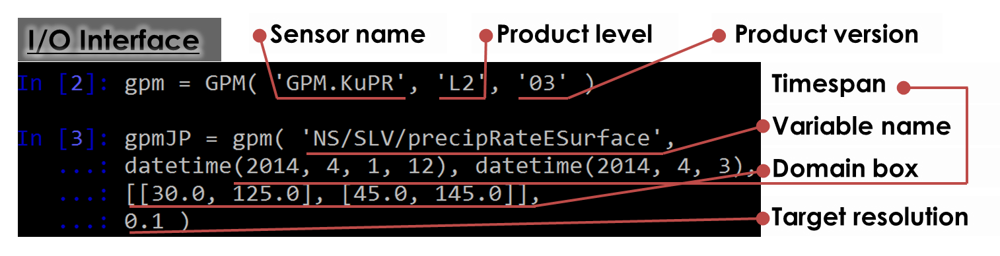
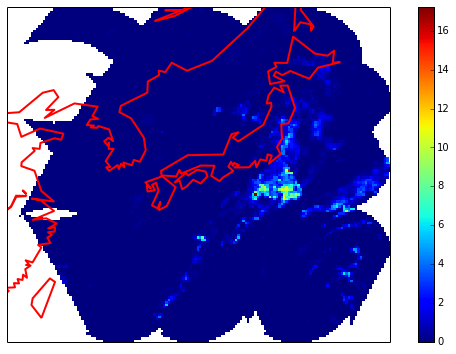

[](https://zenodo.org/badge/latestdoi/19166/kimlab/GPyM)
[](LICENSE.md)


# GPyM
GPyM [dʒi:pai:ɜm / gee pai em] is a GPM (Global Precipitation Mission) Python Module to handle (e.g., search, extract, mapping, and so on) GPM/DPR/GMI and TRMM/PR/TMI. It is a working beta currently (2016-06-01). First official release will be by July 2016.

### Features
* Search and extract granules by timespan and spatial domain
* Convert and upscale granules to a gridded format 
* Cached IO to speed up for repeated tasks 

### Installation

#### Dependency
* numpy: python array manipulation module 
* h5py: python HDF5 IO module (for GPM/DPR/GMI) 
* pyhdf   : python HDF4 IO module (for TRMM/PR/TMI) 

### Download and Install Package
```bash
$ git@github.com:kimlab/GPyM.git

$ cd GPyM

$ vi setup.py # to specify GPM data directory

$ python setup.py install
```
### Syntax


### Example
```python
from pylab import *
%matplotlib inline
rcParams['figure.figsize'] = (10, 6)

from mpl_toolkits.basemap import Basemap

from datetime import datetime

from GPyM import GPM
```


```python
prdLv   = 'L2'
prdVer  = '03'
#prjName = 'GPM.KuPR'
#varName = 'NS/SLV/precipRateESurface'
prdName = 'GPM.GMI'
varName = 'S1/surfacePrecipitation'
```


```python
gpm = GPM( prdName, prdLv, prdVer )
```


```python
sdtime = datetime(2014,4,30)
edtime = datetime(2014,5,3)
domain = [[20,118],[48,150]]
res    = 0.2
```


```python
jp = gpm( varName, sdtime, edtime, domain, res)
```

    * [V] ground track dimension (cached): /tank/hjkim/GPM//GPM.GMI/L2/03/2014/04/GPMCOR_GMI_1404300048_0220_000955_L2S_GL2_03C.h5
    * [_] ground track dimension (cached): /tank/hjkim/GPM//GPM.GMI/L2/03/2014/04/GPMCOR_GMI_1404300220_0353_000956_L2S_GL2_03C.h5
    * [_] ground track dimension (cached): /tank/hjkim/GPM//GPM.GMI/L2/03/2014/04/GPMCOR_GMI_1404300353_0525_000957_L2S_GL2_03C.h5
    * [_] ground track dimension (cached): /tank/hjkim/GPM//GPM.GMI/L2/03/2014/04/GPMCOR_GMI_1404300525_0658_000958_L2S_GL2_03C.h5
    * [_] ground track dimension (cached): /tank/hjkim/GPM//GPM.GMI/L2/03/2014/04/GPMCOR_GMI_1404300658_0830_000959_L2S_GL2_03C.h5
    * [_] ground track dimension (cached): /tank/hjkim/GPM//GPM.GMI/L2/03/2014/04/GPMCOR_GMI_1404300830_1003_000960_L2S_GL2_03C.h5
    * [_] ground track dimension (cached): /tank/hjkim/GPM//GPM.GMI/L2/03/2014/04/GPMCOR_GMI_1404301003_1136_000961_L2S_GL2_03C.h5
    * [_] ground track dimension (cached): /tank/hjkim/GPM//GPM.GMI/L2/03/2014/04/GPMCOR_GMI_1404301136_1308_000962_L2S_GL2_03C.h5
    * [_] ground track dimension (cached): /tank/hjkim/GPM//GPM.GMI/L2/03/2014/04/GPMCOR_GMI_1404301308_1441_000963_L2S_GL2_03C.h5
    * [V] ground track dimension (cached): /tank/hjkim/GPM//GPM.GMI/L2/03/2014/04/GPMCOR_GMI_1404301441_1613_000964_L2S_GL2_03C.h5
    * [V] ground track dimension (cached): /tank/hjkim/GPM//GPM.GMI/L2/03/2014/04/GPMCOR_GMI_1404301613_1746_000965_L2S_GL2_03C.h5
    * [_] ground track dimension (cached): /tank/hjkim/GPM//GPM.GMI/L2/03/2014/04/GPMCOR_GMI_1404301746_1918_000966_L2S_GL2_03C.h5
    * [_] ground track dimension (cached): /tank/hjkim/GPM//GPM.GMI/L2/03/2014/04/GPMCOR_GMI_1404301918_2051_000967_L2S_GL2_03C.h5
    * [_] ground track dimension (cached): /tank/hjkim/GPM//GPM.GMI/L2/03/2014/04/GPMCOR_GMI_1404302051_2223_000968_L2S_GL2_03C.h5
    * [_] ground track dimension (cached): /tank/hjkim/GPM//GPM.GMI/L2/03/2014/04/GPMCOR_GMI_1404302223_2356_000969_L2S_GL2_03C.h5
    * [V] ground track dimension (cached): /tank/hjkim/GPM//GPM.GMI/L2/03/2014/04/GPMCOR_GMI_1404302356_0129_000970_L2S_GL2_03C.h5
    * [_] ground track dimension (cached): /tank/hjkim/GPM//GPM.GMI/L2/03/2014/05/GPMCOR_GMI_1405010129_0301_000971_L2S_GL2_03C.h5
    * [_] ground track dimension (cached): /tank/hjkim/GPM//GPM.GMI/L2/03/2014/05/GPMCOR_GMI_1405010301_0434_000972_L2S_GL2_03C.h5
    * [_] ground track dimension (cached): /tank/hjkim/GPM//GPM.GMI/L2/03/2014/05/GPMCOR_GMI_1405010434_0606_000973_L2S_GL2_03C.h5
    * [_] ground track dimension (cached): /tank/hjkim/GPM//GPM.GMI/L2/03/2014/05/GPMCOR_GMI_1405010606_0739_000974_L2S_GL2_03C.h5
    * [_] ground track dimension (cached): /tank/hjkim/GPM//GPM.GMI/L2/03/2014/05/GPMCOR_GMI_1405010739_0911_000975_L2S_GL2_03C.h5
    * [_] ground track dimension (cached): /tank/hjkim/GPM//GPM.GMI/L2/03/2014/05/GPMCOR_GMI_1405010911_1044_000976_L2S_GL2_03C.h5
    * [_] ground track dimension (cached): /tank/hjkim/GPM//GPM.GMI/L2/03/2014/05/GPMCOR_GMI_1405011044_1217_000977_L2S_GL2_03C.h5
    * [_] ground track dimension (cached): /tank/hjkim/GPM//GPM.GMI/L2/03/2014/05/GPMCOR_GMI_1405011217_1349_000978_L2S_GL2_03C.h5
    * [V] ground track dimension (cached): /tank/hjkim/GPM//GPM.GMI/L2/03/2014/05/GPMCOR_GMI_1405011349_1522_000979_L2S_GL2_03C.h5
    * [V] ground track dimension (cached): /tank/hjkim/GPM//GPM.GMI/L2/03/2014/05/GPMCOR_GMI_1405011522_1654_000980_L2S_GL2_03C.h5
    * [_] ground track dimension (cached): /tank/hjkim/GPM//GPM.GMI/L2/03/2014/05/GPMCOR_GMI_1405011654_1827_000981_L2S_GL2_03C.h5
    * [_] ground track dimension (cached): /tank/hjkim/GPM//GPM.GMI/L2/03/2014/05/GPMCOR_GMI_1405011827_1959_000982_L2S_GL2_03C.h5
    * [_] ground track dimension (cached): /tank/hjkim/GPM//GPM.GMI/L2/03/2014/05/GPMCOR_GMI_1405011959_2132_000983_L2S_GL2_03C.h5
    * [_] ground track dimension (cached): /tank/hjkim/GPM//GPM.GMI/L2/03/2014/05/GPMCOR_GMI_1405012132_2305_000984_L2S_GL2_03C.h5
    * [V] ground track dimension (cached): /tank/hjkim/GPM//GPM.GMI/L2/03/2014/05/GPMCOR_GMI_1405012305_0037_000985_L2S_GL2_03C.h5
    * [V] ground track dimension (cached): /tank/hjkim/GPM//GPM.GMI/L2/03/2014/05/GPMCOR_GMI_1405020037_0210_000986_L2S_GL2_03C.h5
    * [_] ground track dimension (cached): /tank/hjkim/GPM//GPM.GMI/L2/03/2014/05/GPMCOR_GMI_1405020210_0342_000987_L2S_GL2_03C.h5
    * [_] ground track dimension (cached): /tank/hjkim/GPM//GPM.GMI/L2/03/2014/05/GPMCOR_GMI_1405020342_0515_000988_L2S_GL2_03C.h5
    * [_] ground track dimension (cached): /tank/hjkim/GPM//GPM.GMI/L2/03/2014/05/GPMCOR_GMI_1405020515_0647_000989_L2S_GL2_03C.h5
    * [_] ground track dimension (cached): /tank/hjkim/GPM//GPM.GMI/L2/03/2014/05/GPMCOR_GMI_1405020647_0820_000990_L2S_GL2_03C.h5
    * [_] ground track dimension (cached): /tank/hjkim/GPM//GPM.GMI/L2/03/2014/05/GPMCOR_GMI_1405020820_0953_000991_L2S_GL2_03C.h5
    * [_] ground track dimension (cached): /tank/hjkim/GPM//GPM.GMI/L2/03/2014/05/GPMCOR_GMI_1405020953_1125_000992_L2S_GL2_03C.h5
    * [_] ground track dimension (cached): /tank/hjkim/GPM//GPM.GMI/L2/03/2014/05/GPMCOR_GMI_1405021125_1258_000993_L2S_GL2_03C.h5
    * [_] ground track dimension (cached): /tank/hjkim/GPM//GPM.GMI/L2/03/2014/05/GPMCOR_GMI_1405021258_1430_000994_L2S_GL2_03C.h5
    * [V] ground track dimension (cached): /tank/hjkim/GPM//GPM.GMI/L2/03/2014/05/GPMCOR_GMI_1405021430_1603_000995_L2S_GL2_03C.h5
    * [_] ground track dimension (cached): /tank/hjkim/GPM//GPM.GMI/L2/03/2014/05/GPMCOR_GMI_1405021603_1735_000996_L2S_GL2_03C.h5
    * [_] ground track dimension (cached): /tank/hjkim/GPM//GPM.GMI/L2/03/2014/05/GPMCOR_GMI_1405021735_1908_000997_L2S_GL2_03C.h5
    * [_] ground track dimension (cached): /tank/hjkim/GPM//GPM.GMI/L2/03/2014/05/GPMCOR_GMI_1405021908_2041_000998_L2S_GL2_03C.h5
    * [_] ground track dimension (cached): /tank/hjkim/GPM//GPM.GMI/L2/03/2014/05/GPMCOR_GMI_1405022041_2213_000999_L2S_GL2_03C.h5
    * [_] ground track dimension (cached): /tank/hjkim/GPM//GPM.GMI/L2/03/2014/05/GPMCOR_GMI_1405022213_2346_001000_L2S_GL2_03C.h5
    * [_] ground track dimension (cached): /tank/hjkim/GPM//GPM.GMI/L2/03/2014/05/GPMCOR_GMI_1405022346_0118_001001_L2S_GL2_03C.h5
    	[READ_HDF5] /tank/hjkim/GPM//GPM.GMI/L2/03/2014/04/GPMCOR_GMI_1404300048_0220_000955_L2S_GL2_03C.h5 (2961, 221) -> (175, 221)
    	[GRANULE2MAP] Domain:[[20, 118], [48, 150]] (175, 221) -> (140, 160)
    	[READ_HDF5] /tank/hjkim/GPM//GPM.GMI/L2/03/2014/04/GPMCOR_GMI_1404301441_1613_000964_L2S_GL2_03C.h5 (2962, 221) -> (175, 221)
    	[GRANULE2MAP] Domain:[[20, 118], [48, 150]] (175, 221) -> (140, 160)
    	[READ_HDF5] /tank/hjkim/GPM//GPM.GMI/L2/03/2014/04/GPMCOR_GMI_1404301613_1746_000965_L2S_GL2_03C.h5 (2962, 221) -> (27, 221)
    	[GRANULE2MAP] Domain:[[20, 118], [48, 150]] (27, 221) -> (140, 160)
    	[READ_HDF5] /tank/hjkim/GPM//GPM.GMI/L2/03/2014/04/GPMCOR_GMI_1404302356_0129_000970_L2S_GL2_03C.h5 (2962, 221) -> (214, 221)
    	[GRANULE2MAP] Domain:[[20, 118], [48, 150]] (214, 221) -> (140, 160)
    	[READ_HDF5] /tank/hjkim/GPM//GPM.GMI/L2/03/2014/05/GPMCOR_GMI_1405011349_1522_000979_L2S_GL2_03C.h5 (2962, 221) -> (56, 221)
    	[GRANULE2MAP] Domain:[[20, 118], [48, 150]] (56, 221) -> (140, 160)
    	[READ_HDF5] /tank/hjkim/GPM//GPM.GMI/L2/03/2014/05/GPMCOR_GMI_1405011522_1654_000980_L2S_GL2_03C.h5 (2962, 221) -> (161, 221)
    	[GRANULE2MAP] Domain:[[20, 118], [48, 150]] (161, 221) -> (140, 160)
    	[READ_HDF5] /tank/hjkim/GPM//GPM.GMI/L2/03/2014/05/GPMCOR_GMI_1405012305_0037_000985_L2S_GL2_03C.h5 (2962, 221) -> (112, 221)
    	[GRANULE2MAP] Domain:[[20, 118], [48, 150]] (112, 221) -> (140, 160)
    	[READ_HDF5] /tank/hjkim/GPM//GPM.GMI/L2/03/2014/05/GPMCOR_GMI_1405020037_0210_000986_L2S_GL2_03C.h5 (2962, 221) -> (96, 221)
    	[GRANULE2MAP] Domain:[[20, 118], [48, 150]] (96, 221) -> (140, 160)
    	[READ_HDF5] /tank/hjkim/GPM//GPM.GMI/L2/03/2014/05/GPMCOR_GMI_1405021430_1603_000995_L2S_GL2_03C.h5 (2962, 221) -> (215, 221)
    	[GRANULE2MAP] Domain:[[20, 118], [48, 150]] (215, 221) -> (140, 160)


```python
print '{} -- {}'.format( jp.dtime[0], jp.dtime[-1] ), jp.data.shape
```

    2014-04-30 01:45:14 -- 2014-05-02 15:06:38 (1231, 221)


```python
print len(jp.griddata), jp.griddata[0].shape
```

    9 (140, 160)


```python
M   = Basemap( resolution='c' ,llcrnrlat=domain[0][0], llcrnrlon=domain[0][1], urcrnrlat=domain[1][0], urcrnrlon=domain[1][1])
M.drawcoastlines(color='r', linewidth=2)

M.imshow( ma.masked_less_equal( jp.griddata, 0).sum(0), interpolation='nearest' )
colorbar()
```


    <matplotlib.colorbar.Colorbar instance at 0x81d5d88>




### History 
#### 0.60b
* [NEW] cache option @ config
* [NEW] cache_directory option @ config
* [NEW] compress (dimension only) option @ config
* [UPGRADE] enhanced console-log
* [UPGRADE] remove cache routine from get_location* and get_dtime*
